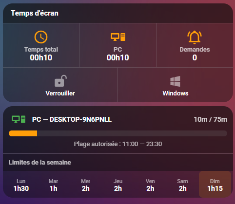

#  Microsoft Family Safety for Home Assistant

[](https://github.com/hacs/integration)
[](https://github.com/noiwid/HAFamilySafety/releases)
[](LICENSE)
[](https://www.home-assistant.io/)

A full-featured Home Assistant custom integration for **Microsoft Family Safety**. Monitor screen time, manage app restrictions, lock accounts, control web filtering, and adjust daily limits — all from your Home Assistant dashboard.

**Supported platforms:** Windows, Xbox, Mobile

> **Domain:** `microsoft_family_safety` | **IoT Class:** Cloud Polling | **Languages:** English, French



---

## Disclaimer

This integration uses **unofficial, undocumented APIs** for Microsoft Family Safety. It is not approved, endorsed, or supported by Microsoft. Microsoft may modify or disable the underlying APIs at any time. Use at your own risk and in compliance with Microsoft's terms of service.

---

## Architecture

The integration consists of **two components** working together:

| Component | Directory | Role |
|-----------|-----------|------|
| **Family Safety Auth Add-on** | `familysafety-playwright/` | Playwright-based browser automation with headless Chromium. Handles Microsoft web authentication and proxies API calls through an authenticated browser session. |
| **Home Assistant Integration** | `custom_components/microsoft_family_safety/` | Config flow integration. Fetches data, exposes entities, handles services, and communicates with the addon for web API operations. |

### Why two components?

Microsoft Family Safety has **two distinct APIs**, each with its own authentication:

| API | Base URL | Auth Method | Capabilities |
|-----|----------|-------------|-------------|
| **Mobile API** | `mobileaggregator.family.microsoft.com` | OAuth token (via `pyfamilysafety`) | Read family roster, app list, screen time usage, web restrictions. Block/unblock apps. |
| **Web API** | `account.microsoft.com/family/api/` | Browser cookies + CSRF token | Read/write screen time schedules, daily limits, time intervals. Web filtering. Content ratings. Purchase controls. |

The mobile API handles basic reads and app management. But **screen time schedule modifications** (daily limits, allowed time intervals) only work through the web API, which requires a full browser session with cookies and a CSRF token extracted from the page DOM.

The addon runs a headless Chromium browser that maintains an authenticated session with Microsoft. The integration calls the addon's HTTP API, which executes `fetch()` calls from within the authenticated browser context — exactly as a real user's browser would.

**Key constraints:**
- The addon must remain running at all times for screen time reads and writes to work
- Microsoft's OAuth silent flow requires the browser to navigate to the family dashboard before each API call (~15-20s per request)
- Screen time modifications are routed through `POST /family/api//st/day-allow` (web API), not the mobile API which returns 400 errors for schedule changes
- The addon hostname is resolved dynamically via the Supervisor API, making the integration portable across installations

---

## Features

| Category | What you can do |
|----------|----------------|
| **Account Lock** | Lock/unlock a child's entire account with a single switch |
| **Screen time monitoring** | Track daily usage per child and per device |
| **Screen time policies** | Adjust daily allowances and allowed time intervals per day — directly from the UI |
| **App management** | Block/unblock apps, set per-app time limits and windows |
| **Web filtering** | Block/unblock domains, toggle content filtering, set PEGI age ratings |
| **Purchase controls** | Enable/disable ask-to-buy via service call |
| **Request handling** | Approve or deny pending screen time requests from HA |
| **Optimistic updates** | UI values update instantly when changing limits or intervals (reverts on failure) |

---

## Installation

### Prerequisites

- **Home Assistant OS** or **Home Assistant Supervised** (the addon requires the Supervisor)
- A **Microsoft parent account** with at least one child in the Family Safety group

### Step 1 — Install the Add-on

The addon provides the browser-based authentication required for screen time features.

1. In Home Assistant, go to **Settings > Add-ons > Add-on Store**
2. Click the **three-dot menu** (top right) > **Repositories**
3. Add: `https://github.com/noiwid/HAFamilySafety`
4. Find **Microsoft Family Safety Auth** in the store and click **Install**
5. Start the addon
6. Open the addon **Web UI** (port 8098) — you'll see the authentication page
7. Click **Start Authentication** and sign in with your Microsoft parent account via the noVNC interface (port 6081)
8. Once authenticated, the addon will extract and store cookies automatically

### Step 2 — Install the Integration

#### Via HACS (Recommended)

1. Open **HACS** in Home Assistant
2. Go to **Integrations** and click the three-dot menu in the top right
3. Select **Custom repositories**
4. Add `https://github.com/noiwid/HAFamilySafety` with category **Integration**
5. Search for **Microsoft Family Safety** in HACS and click **Download**
6. Restart Home Assistant

#### Manual Installation

1. Download the latest release from [GitHub Releases](https://github.com/noiwid/HAFamilySafety/releases)
2. Copy the `custom_components/microsoft_family_safety` folder into your `config/custom_components/` directory
3. Restart Home Assistant

### Step 3 — Configure the Integration

1. Go to **Settings > Devices & Services > Add Integration**
2. Search for **Microsoft Family Safety**
3. An authentication URL is displayed — copy it and open it in your browser (incognito recommended)
4. Sign in with your **Microsoft parent account**
5. You will be redirected to a blank page. Copy the **entire URL** from the address bar:
   ```
   https://login.live.com/oauth20_desktop.srf?code=M.C123_ABC...&lc=1033
   ```
6. Paste the redirect URL back into the Home Assistant form
7. Select your monitored platforms (Windows, Xbox, Mobile) and polling interval
8. Submit — the integration will discover all child accounts and devices automatically

> **Note:** The addon status is shown during setup. If detected, screen time schedule reading and writing will be enabled automatically.

### Add-on Configuration

| Option | Default | Description |
|--------|---------|-------------|
| `log_level` | `info` | Logging verbosity (`trace`, `debug`, `info`, `warning`, `error`) |
| `auth_timeout` | `300` | Seconds to wait for user to complete authentication (60-600) |
| `session_duration` | `86400` | Session validity in seconds (1h-7d) |
| `language` | *(auto)* | Browser locale (e.g., `fr-FR`, `en-US`) |
| `timezone` | *(auto)* | Browser timezone (e.g., `Europe/Paris`) |
| `vnc_password` | `familysafety` | Password for the noVNC interface |

### Integration Options

After setup, go to **Settings > Devices & Services > Microsoft Family Safety > Configure**:

| Option | Range | Default |
|--------|-------|---------|
| Update interval | 30 – 3600 seconds | 300 seconds (5 min) |

---

## Devices & Entities

The integration creates two types of HA devices:

| Device Type | Name Example | Manufacturer | Model |
|-------------|-------------|--------------|-------|
| Child account | Maceo Collin (Family Safety) | Microsoft | Family Safety Account |
| Physical device | DESKTOP-9N6PNLL | From API | From API |

Physical devices are linked to their parent child account via `via_device`.

### Sensors — Per Child Account

| Entity | Entity ID | State | Key Attributes |
|--------|-----------|-------|----------------|
| Screen Time | `sensor.{name}_screen_time` | Minutes used today | `formatted_time`, `hours`, `minutes`, `average_screentime`, `date` |
| Account Info | `sensor.{name}_account_info` | Full name | `user_id`, `first_name`, `surname`, `profile_picture`, `device_count` |
| Applications | `sensor.{name}_applications` | App count | `blocked_count`, `applications` |
| Balance | `sensor.{name}_balance` | Account balance | *(monetary sensor, only if available)* |
| Pending Requests | `sensor.{name}_pending_requests` | Request count | `requests` |
| Web Filter | `sensor.{name}_web_filter` | enabled / disabled / unknown | `blockedSites`, `allowedSites`, `contentRatingAge` |
| Screen Time Policy | `sensor.{name}_screen_time_policy` | enabled / disabled / unknown | `monday_allowance` ... `sunday_allowance`, `daily_restrictions` |

### Sensors — Per Physical Device

| Entity | Entity ID | State | Key Attributes |
|--------|-----------|-------|----------------|
| Device Screen Time | `sensor.{device}_screen_time` | Minutes used today | — |
| Device Info | `sensor.{device}_info` | Device name | `model`, `OS`, `last_seen` |

### Switches — Per Child Account

| Entity | Entity ID | Behavior |
|--------|-----------|----------|
| **Account Lock** | `switch.{name}_lock` | **ON = account locked** (all screen time set to 0). Saves quotas before locking, restores on unlock. Persists across restarts. |
| App Block | `switch.{name}_app_{appname}` | ON = app blocked. One switch per application. |
| Platform Lock *(deprecated)* | `switch.{name}_{platform}_lock` | ON = platform locked. **Use Account Lock instead** — per-platform lock relies on a broken Microsoft API. |

### Buttons — Per Child Account

| Entity | Entity ID | Action |
|--------|-----------|--------|
| Approve Request | `button.{name}_approve_request` | Approves the oldest pending screen time request (+1 hour) |
| Deny Request | `button.{name}_deny_request` | Denies the oldest pending request |

### Number Entities — Per Child Account (7 per child)

| Entity | Entity ID | Range | Step |
|--------|-----------|-------|------|
| Daily Limit | `number.{name}_{day}_limit` | 0 – 1440 minutes | 15 min |

One entity per day of the week (Sunday through Saturday). Adjustable directly from the UI with **optimistic updates** — values reflect immediately.

### Time Entities — Per Child Account (14 per child)

| Entity | Entity ID | Description |
|--------|-----------|-------------|
| Interval Start | `time.{name}_{day}_start` | Start of the allowed screen time window |
| Interval End | `time.{name}_{day}_end` | End of the allowed screen time window |

One start/end pair per day of the week. Editable from the UI with optimistic updates.

---

## Services

The integration exposes **17 services**, split between the pyfamilysafety library and the web API.

### Account Lock

```yaml
# Lock a child account (sets all screen time to 0, saves current policy)
service: microsoft_family_safety.lock_account
data:
  account_id: "1055519684390826"
```

```yaml
# Unlock a child account (restores saved policy)
service: microsoft_family_safety.unlock_account
data:
  account_id: "1055519684390826"
```

### App Management

```yaml
# Block an application
service: microsoft_family_safety.block_app
data:
  account_id: "1055519684390826"
  app_id: "app-uuid"
```

```yaml
# Unblock an application
service: microsoft_family_safety.unblock_app
data:
  account_id: "1055519684390826"
  app_id: "app-uuid"
```

```yaml
# Set a per-app daily time limit with allowed window
service: microsoft_family_safety.set_app_time_limit
data:
  account_id: "1055519684390826"
  app_id: "app-uuid"
  app_name: "Minecraft"
  platform: "windows"
  hours: 1
  minutes: 30
  start_time: "08:00:00"
  end_time: "20:00:00"
```

```yaml
# Remove a per-app time limit
service: microsoft_family_safety.remove_app_time_limit
data:
  account_id: "1055519684390826"
  app_id: "app-uuid"
  app_name: "Minecraft"
  platform: "windows"
```

### Screen Time

```yaml
# Set daily screen time allowance
service: microsoft_family_safety.set_screentime_limit
data:
  account_id: "1055519684390826"
  day_of_week: 1  # 0=Sunday, 6=Saturday
  hours: 2
  minutes: 0
```

```yaml
# Set allowed time window (30-min precision)
service: microsoft_family_safety.set_screentime_intervals
data:
  account_id: "1055519684390826"
  day_of_week: 1
  start_hour: 8
  start_minute: 0
  end_hour: 20
  end_minute: 30
```

### Request Handling

```yaml
# Approve a pending screen time request (+N minutes)
service: microsoft_family_safety.approve_request
data:
  request_id: "request-uuid"
  extension_minutes: 60
```

```yaml
# Deny a pending request
service: microsoft_family_safety.deny_request
data:
  request_id: "request-uuid"
```

### Web Filtering

```yaml
# Block a website
service: microsoft_family_safety.block_website
data:
  account_id: "1055519684390826"
  website: "example.com"
```

```yaml
# Remove a blocked website
service: microsoft_family_safety.remove_website
data:
  account_id: "1055519684390826"
  website: "example.com"
```

```yaml
# Toggle web content filtering
service: microsoft_family_safety.toggle_web_filter
data:
  account_id: "1055519684390826"
  enabled: true
```

### Content & Purchase Controls

```yaml
# Set age rating (PEGI 3-20, or 21 for unrestricted)
service: microsoft_family_safety.set_age_rating
data:
  account_id: "1055519684390826"
  age: 12
```

```yaml
# Enable or disable ask-to-buy
service: microsoft_family_safety.set_acquisition_policy
data:
  account_id: "1055519684390826"
  require_approval: true
```

---

## Automation Examples

### Lock account on school nights

```yaml
automation:
  - alias: "Lock account at 21:00"
    trigger:
      - platform: time
        at: "21:00:00"
    condition:
      - condition: time
        weekday: [sun, mon, tue, wed, thu]
    action:
      - action: switch.turn_on
        target:
          entity_id: switch.maceo_lock

  - alias: "Unlock account at 07:00"
    trigger:
      - platform: time
        at: "07:00:00"
    action:
      - action: switch.turn_off
        target:
          entity_id: switch.maceo_lock
```

### Screen time alert

```yaml
automation:
  - alias: "Screen time limit alert"
    trigger:
      - platform: numeric_state
        entity_id: sensor.maceo_screen_time
        above: 120
    action:
      - action: notify.mobile_app_your_phone
        data:
          title: "Screen Time Alert"
          message: >
            {{ state_attr('sensor.maceo_screen_time', 'formatted_time') }}
            of screen time used today.
```

### Set weekday limits automatically

```yaml
automation:
  - alias: "Set weekday screen time limits"
    trigger:
      - platform: time
        at: "00:05:00"
    condition:
      - condition: time
        weekday: [mon, tue, wed, thu, fri]
    action:
      - action: microsoft_family_safety.set_screentime_limit
        data:
          account_id: "1055519684390826"
          day_of_week: "{{ now().weekday() }}"
          hours: 1
          minutes: 30
```

### Watchdog — prevent manual unlock

```yaml
automation:
  - alias: "Anti-bypass watchdog"
    trigger:
      - trigger: state
        entity_id: switch.maceo_lock
        to: "off"
    condition:
      - condition: time
        after: "21:00:00"
        before: "07:00:00"
    action:
      - action: switch.turn_on
        target:
          entity_id: switch.maceo_lock
```

### Dashboard card

A ready-to-use dashboard card is available in [`examples/dashboard.yaml`](examples/dashboard.yaml). It includes:

- Screen time overview (total + per device)
- Pending requests counter
- Lock/unlock buttons (account + Windows)
- Device card with progress bar and allowed time window
- Weekly limits grid (tap to edit limit, hold to edit time window)

**Required HACS frontend cards:** `button-card`, `stack-in-card`, `vertical-stack-in-card`, `mod-card`, `mushroom`

---

## Troubleshooting

### Addon not detected during setup

- Make sure the addon is **started** (green icon in the Add-ons page)
- The integration resolves the addon hostname dynamically via the Supervisor API — no manual URL configuration needed
- If running HA Core/Container (no Supervisor), the addon must be deployed as a standalone Docker container and the URL configured manually in the integration options

### Authentication expired / cookies stale

- Open the addon Web UI and click **Re-authenticate**
- The addon stores the browser profile in `/share/familysafety/` — cookies persist across addon restarts
- If the session is completely dead (redirect to marketing page), re-authenticate via the noVNC interface

### Screen time reads return `unknown`

- Ensure the addon is running — screen time schedules are fetched through the addon's browser session
- Check addon logs: look for `browser_fetch: success` messages
- If you see `LOGIN_REDIRECT` errors, the session has expired — re-authenticate

### Screen time writes fail

- Writes go through the addon's browser POST endpoint (`/api/screentime/set-allowance`)
- Each write takes ~20-30 seconds (browser must navigate to the family dashboard first)
- If you get timeout errors, increase the polling interval to reduce concurrent browser usage

### Account Lock issues

- **Lock takes a few seconds** — the integration sets quotas for all 7 days via sequential API calls
- **Unlock restores defaults if HA storage was cleared** — if `.storage/microsoft_family_safety.saved_screentime` is deleted, unlock will restore 2h/day, 07:00-22:00 as a safe default
- **Lock is account-wide** — it affects all platforms simultaneously

### Debug logging

```yaml
logger:
  default: info
  logs:
    custom_components.microsoft_family_safety: debug
    pyfamilysafety: debug
```

---

## Known Limitations

- **Unofficial API** — Microsoft provides no public API for Family Safety. This integration relies on reverse-engineered endpoints that may change or break at any time.
- **Per-platform lock is broken** — Microsoft removed the `override_device` endpoint. The Account Lock switch is the recommended replacement but locks all platforms at once.
- **Addon required for screen time** — Reading and writing screen time schedules requires the companion addon with its browser session. Without it, only basic data from the mobile API is available.
- **One API call at a time** — The addon uses a single browser instance with a lock. Concurrent requests are queued, which can cause delays during heavy usage.
- **Session maintenance** — Microsoft sessions can expire after extended periods. The addon handles OAuth silent flows automatically, but occasional re-authentication via the noVNC interface may be needed.
- **HA Core/Container** — The addon is designed for HA OS/Supervised. For HA Core or Container installations, you need to run the Playwright service as a standalone Docker container.

---

## API Reference

Microsoft Family Safety exposes **two distinct APIs**. This integration uses both, each for specific capabilities.

### Mobile API — `mobileaggregator.family.microsoft.com`

**Authentication:** OAuth Bearer token (acquired via `pyfamilysafety`)

Used for read operations and app management. Token-based, no browser session required.

| Method | Endpoint | Description | Used by |
|--------|----------|-------------|---------|
| GET | `/v1/WebRestrictions/{childId}` | Web filter settings & blocked sites | `sensor.web_filter` |
| GET | `/v1/DeviceLimits/{childId}/overrides` | Active device overrides | `switch.lock` |
| PATCH | `/v4/devicelimits/schedules/{childId}` | ~~Set screen time schedule~~ | **Broken** (400 error) |
| POST | `/v1/devicelimits/{childId}/overrides` | ~~Lock device~~ | **Broken** (Microsoft removed) |

> The mobile API's schedule and device override endpoints no longer work reliably. All screen time writes now go through the web API.

### Web API — `account.microsoft.com/family/api/`

**Authentication:** Browser cookies + CSRF token (`__RequestVerificationToken` from DOM hidden input + `canary` cookie). All requests require the headers `X-AMC-JsonMode: CamelCase`, `X-Requested-With: XMLHttpRequest`, and `Content-Type: application/json`.

Routed through the addon's browser session. Used for screen time reads/writes and all settings.

#### Read Endpoints (GET)

| Endpoint | Query Params | Description | Used by |
|----------|-------------|-------------|---------|
| `/family/api/roster` | — | Family members list | Coordinator |
| `/family/api/st` | `childId` | Screen time policy (per-device, Windows) | `sensor.screen_time_policy`, `number.*_limit`, `time.*_start/end` |
| `/family/api/screen-time-global` | `childId` | Global screen time toggle | — |
| `/family/api/screen-time-xbox` | `childId` | Xbox screen time policy | — |
| `/family/api/device-limits/get-devices` | `childId` | Connected devices list | — |
| `/family/api/app-limits/get-all-app-policies-v3` | `childId` | All app policies | `switch.app_*` |
| `/family/api/app-limits/get-app-time-extension-requests` | `memberIdList` | Pending extension requests | `sensor.pending_requests`, `button.approve/deny` |
| `/family/api/recent-activity/report-v3` | `childId`, `isPreviousWeek`, `timeZone` | Activity report | `sensor.screen_time` |
| `/family/api/settings/web-browsing` | `childId` | Web filter settings | `sensor.web_filter` |

#### Write Endpoints (POST/PUT/DELETE)

| Method | Endpoint | Body | Description |
|--------|----------|------|-------------|
| POST | `/family/api//st/day-allow` | `{childId, dayOfWeek, timeSpanDays, timeSpanHours, timeSpanMinutes}` | Set daily screen time allowance |
| POST | `/family/api//st/day-allow-int` | `{childId, dayOfWeek, allowedIntervals: [48 booleans]}` | Set allowed time intervals (30-min slots) |
| POST | `/family/api/app-limits/set-custom-app-policy-v3` | `{childId, appPolicy: {...}, platform}` | Block/unblock/limit an app |
| POST | `/family/api/settings/block-website` | `{childId, website}` | Block a website |
| DELETE | `/family/api/settings/remove-website` | `?childId=&website=` | Remove a blocked/allowed website |
| POST | `/family/api/settings/web-browsing-toggle` | `{childId, isEnabled}` | Toggle web content filtering |
| PUT | `/family/api/settings/update-content-settings` | `{childId, contentRatingAge}` | Set age rating (3-20, 21=unrestricted) |
| POST | `/family/api/ps/set-acquisition-policy` | `{childId, policy}` | Set ask-to-buy (`freeOnly` / `unrestricted`) |

#### Screen Time Response Structure

`GET /family/api/st?childId={childId}` returns:

```json
{
  "userId": "1055519684390826",
  "isEnabled": true,
  "dailyRestrictions": {
    "monday": {
      "dayOfWeek": "monday",
      "allowance": "01:00:00",
      "allowedIntervals": [
        {
          "begin": "PT7H",
          "beginTimeSpan": "07:00:00",
          "end": "PT23H",
          "endTimeSpan": "23:00:00"
        }
      ],
      "timeline": [false, false, ..., true, true, ..., false, false]
    }
  }
}
```

- `allowance`: daily limit as `HH:MM:SS`
- `allowedIntervals[].beginTimeSpan/endTimeSpan`: window boundaries as `HH:MM:SS`
- `timeline`: 48 booleans representing 30-min slots (index 0 = 00:00, index 14 = 07:00)

### Addon API — `http://{addon-hostname}:8098`

The addon exposes a local HTTP API that proxies requests through the authenticated browser session.

| Method | Endpoint | Description |
|--------|----------|-------------|
| GET | `/api/health` | Health check |
| POST | `/api/auth/start` | Start authentication session |
| GET | `/api/auth/status/{session_id}` | Check auth session status |
| GET | `/api/cookies/check` | Check cookie freshness |
| GET | `/api/cookies` | Get stored cookies |
| DELETE | `/api/cookies` | Delete stored cookies |
| GET | `/api/screentime?childId=` | Fetch screen time via browser |
| POST | `/api/screentime/set-allowance` | Set daily allowance via browser |
| POST | `/api/screentime/set-intervals` | Set time intervals via browser |

### Capabilities Matrix

| Action | Web API | Mobile API | Status |
|--------|:---:|:---:|--------|
| View family roster | GET | — | Working |
| View screen time usage | — | GET | Working |
| Read screen time schedule | GET | — | Working (via addon) |
| Set daily screen time allowance | POST | ~~PATCH~~ | Working (web only) |
| Set allowed time intervals | POST | ~~PATCH~~ | Working (web only) |
| Block/unblock an app | POST | POST | Working |
| Set per-app time limits | POST | — | Working |
| Block/allow a website | POST/DELETE | — | Working |
| Toggle web filtering | POST | — | Working |
| Set content age rating | PUT | — | Working |
| Set ask-to-buy policy | POST | — | Working |
| **Lock device (instant)** | **N/A** | ~~POST~~ | **Broken** (Microsoft removed) |
| Lock account (workaround) | POST x14 | — | Working (sets all quotas to 0) |

---

## Contributing

Contributions are welcome!

1. Fork the repository
2. Create a feature branch (`git checkout -b feature/my-feature`)
3. Commit your changes and open a pull request

Areas where help is especially appreciated:
- Microsoft API endpoint documentation and analysis
- Authentication improvements (automatic token refresh)
- Additional language translations
- Testing across different Family Safety account configurations

---

## Acknowledgments

- **[pantherale0](https://github.com/pantherale0)** — original [ha-familysafety](https://github.com/pantherale0/ha-familysafety) integration and [pyfamilysafety](https://github.com/pantherale0/pyfamilysafety) library
- The **Home Assistant** community for feedback and testing

---

## License

This project is licensed under the [MIT License](LICENSE).

---

## Support

- [GitHub Issues](https://github.com/noiwid/HAFamilySafety/issues)
- [GitHub Discussions](https://github.com/noiwid/HAFamilySafety/discussions)

When reporting an issue, please include: HA version, integration version, addon version, debug logs (both HA and addon), and steps to reproduce.
