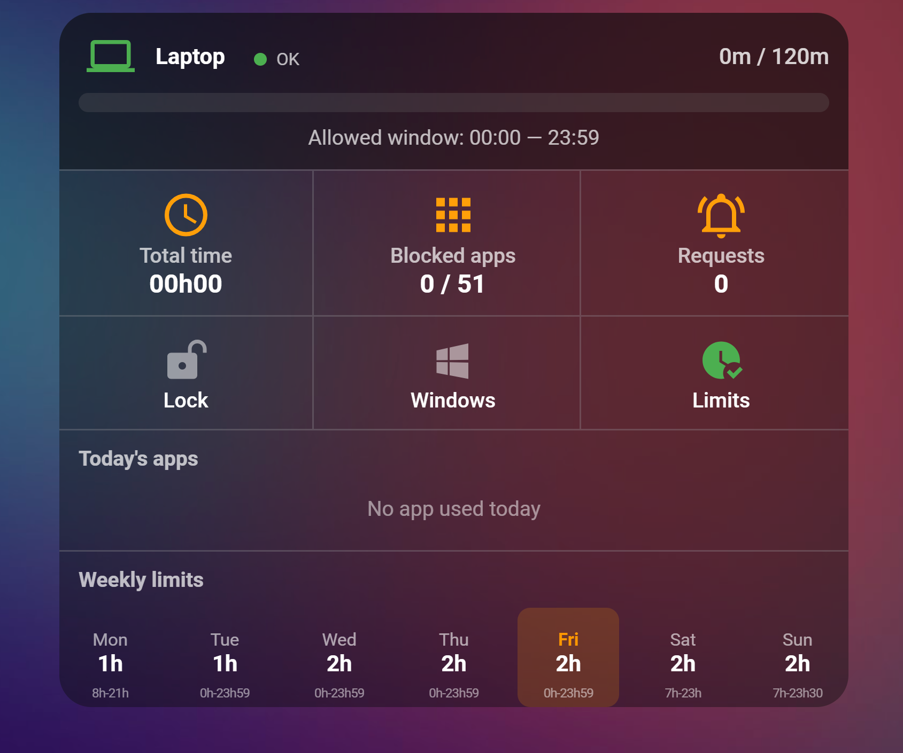

#  Microsoft Family Safety for Home Assistant

[![GitHub Release][releases-shield]][releases]
[![HACS][hacs-shield]][hacs]
[![License][license-shield]][license]
[](https://buymeacoffee.com/noiwid)

A full-featured Home Assistant custom integration for **Microsoft Family Safety**. Monitor screen time, manage app restrictions, lock accounts, control web filtering, and adjust daily limits — all from your Home Assistant dashboard.

Authentication is **native**: you sign in to Microsoft from Home Assistant itself. The Playwright auth add-on is no longer required and is kept only as a [legacy fallback](#legacy-add-on-mode).

**Supported platforms:** Windows, Xbox, Mobile

> **Domain:** `microsoft_family_safety` | **IoT Class:** Cloud Polling | **Languages:** English, French, German



---

## Disclaimer

This integration uses **unofficial, undocumented APIs** for Microsoft Family Safety. It is not approved, endorsed, or supported by Microsoft. Microsoft may modify or disable the underlying APIs at any time. Use at your own risk and in compliance with Microsoft's terms of service.

---

## Breaking changes

> **If you are upgrading from a version that used the Playwright auth add-on, read this before you upgrade.**

### Entity IDs change when you re-add the integration

Native authentication requires a **new config entry**. When you remove the old integration entry and add it again, Home Assistant generates fresh entity IDs, and the new ones include the device name as a prefix:

| Before | After |
|--------|-------|
| `number.firstname_sunday_limit` | `number.firstname_lastname_family_safety_firstname_sunday_limit` |
| `switch.firstname_lock` | `switch.firstname_family_safety_firstname_lock` |
| `button.firstname_approve_request` | `button.firstname_family_safety_firstname_approve_request` |

This **breaks dashboards, automations, scripts and templates** that reference the old IDs. After migrating:

1. Go to **Settings > Devices & Services > Entities** and check for entities marked *restored / unavailable* — those are the old IDs.
2. Either rename the new entities back to the old IDs (**Entities > entity > Settings > Entity ID**), which is the fastest way to keep existing YAML working, or update every reference.
3. Search your config for the old IDs:
   ```bash
   grep -rn "switch\.<name>_lock\|number\.<name>_.*_limit\|time\.<name>_" config/
   ```
   Don't forget **dashboard YAML**, **automations**, **scripts**, **scenes**, **template sensors**, and the **example dashboard** in [`examples/dashboard.yaml`](examples/dashboard.yaml), which still uses the old convention.

> Note the device-name prefix is not identical across platforms: sensors, numbers and time entities are prefixed with *first name + surname*, while switches and buttons are prefixed with the *first name only*.

### The add-on is no longer required

The Playwright auth add-on is now a **legacy fallback**. New installations should not install it. Existing installations keep working unchanged — see [Legacy add-on mode](#legacy-add-on-mode).

---

## Architecture

The integration authenticates natively inside Home Assistant and talks to both Microsoft backends itself. **No add-on, no browser automation, and no separate container are needed in the normal case.**

### The two Microsoft APIs

Microsoft Family Safety has **two distinct APIs**, each with its own authentication. The integration uses both:

| API | Base URL | Auth Method | Capabilities |
|-----|----------|-------------|-------------|
| **Mobile API** | `mobileaggregator.family.microsoft.com` | OAuth Bearer token (from a refresh token) | Family roster, devices, app list, screen time usage, web restrictions, content restrictions. Block/unblock apps, approve/deny requests. |
| **Web API** (private) | `account.microsoft.com/family/api/` | Microsoft session cookies + a `__RequestVerificationToken` antiforgery token | Read/write screen time schedules (daily limits, allowed intervals), app time limits, web filtering, content ratings, purchase controls. |

**Screen time schedule modifications only work through the web API** — the mobile API's schedule and device-override endpoints were removed or changed by Microsoft and return HTTP 400.

### How native authentication works

Signing in happens in **two phases**, both driven from your normal browser through a short-lived reverse proxy that Home Assistant mounts inside its own HTTP server:

**Phase A — mobile OAuth.** You sign in to Microsoft through the proxy. Home Assistant captures the OAuth redirect automatically (you no longer copy and paste a redirect URL), which yields the refresh token used for the mobile API. The Microsoft SSO cookies collected along the way stay server-side.

**Phase B — Family web session.** Home Assistant first tries to establish the Family session **entirely server-side**, reusing the cookies from phase A to load the Family dashboard and read its `__RequestVerificationToken`. When this succeeds — the common case — you never see a second sign-in window.

When it does not succeed, Home Assistant falls back to sending your browser back through the proxy to complete Microsoft's silent Family SSO. **This browser fallback is required and cannot be removed**: a cold-start, purely server-side bootstrap is impossible because Microsoft gates the Family dashboard behind an interactive `prompt=none` OAuth hop. Phase B may take up to about 60 seconds; Home Assistant shows a waiting screen while it completes.

### After sign-in: no browser at all

Once the Family session is established, Home Assistant calls the private web API **directly over HTTP** from the integration. Screen time reads and writes are ordinary HTTPS requests:

- `POST /family/api//st/day-allow` — daily allowance
- `POST /family/api//st/day-allow-int` — allowed 30-minute intervals

Locking an account is 14 requests (7 days × allowance + intervals) and completes in seconds, rather than the ~15-30 s per operation the browser-based add-on needed.

### Data flow

```
Poll loop (default every 5 min)
  ├─ Mobile API   → roster, devices, apps, screen time usage, content restrictions
  └─ Web API      → screen time schedule (daily limits + allowed intervals)

Service call / entity write
  ├─ Mobile API   → block/unblock app, approve/deny request
  └─ Web API      → screen time limits & intervals, app limits, websites,
                    age rating, ask-to-buy
```

### Legacy add-on mode

The `familysafety-playwright/` add-on is still supported. An entry runs in legacy mode when it has **no natively captured web session** — that is, existing entries created before native auth, and new entries where an add-on was detected or an **auth URL** was configured.

In legacy mode, screen time reads and writes are routed through the add-on's authenticated Chromium session, exactly as before. The add-on remains useful when:

- you already have a working add-on setup and don't want to re-authenticate and rename entities;
- your Home Assistant instance is not reachable over HTTPS and you don't want to enable the local-HTTP option (see [Security & limitations](#security--limitations));
- native authentication fails on your account for any reason.

Legacy and native mode are mutually exclusive per config entry; there is no automatic downgrade from native to add-on at runtime.

---

## Features

| Category | What you can do |
|----------|----------------|
| **Native authentication** | Sign in to Microsoft directly from Home Assistant — no add-on, no container, no copy-pasted redirect URL |
| **Account Lock** | Lock/unlock a child's entire account with a single switch |
| **Screen time monitoring** | Track daily usage per child and per device |
| **Screen time policies** | Adjust daily allowances and allowed time intervals per day — directly from the UI |
| **App management** | Block/unblock apps, set per-app time limits and windows |
| **Web filtering** | Block/unblock domains, toggle content filtering, set PEGI age ratings |
| **Purchase controls** | Enable/disable ask-to-buy via service call |
| **Request handling** | Approve or deny pending screen time requests from HA |
| **Connection diagnostics** | A dedicated sensor reports whether the mobile API and the web session are healthy |
| **Optimistic updates** | UI values update instantly when changing limits or intervals (reverts on failure) |

---

## Installation

### Prerequisites

- **Home Assistant** 2024.1.0 or newer, running on any installation type (OS, Supervised, Container, Core)
- A Home Assistant URL reachable from your browser over **HTTPS**. If your instance is HTTP-only on the local network, see [`allow_insecure_http_auth`](#insecure-local-http-authentication)
- A **Microsoft parent account** with at least one child in the Family Safety group

> No add-on and no Docker container are required.

### Step 1 — Install the Integration

#### Via HACS (Recommended)

1. Open **HACS** in Home Assistant
2. Go to **Integrations** and click the three-dot menu in the top right
3. Select **Custom repositories**
4. Add `https://github.com/noiwid/HAFamilySafety` with category **Integration**
5. Search for **Microsoft Family Safety** in HACS and click **Download**
6. Restart Home Assistant

#### Manual Installation

1. Download the latest release from [GitHub Releases](https://github.com/noiwid/HAFamilySafety/releases)
2. Copy the `custom_components/microsoft_family_safety` folder into your `config/custom_components/` directory
3. Restart Home Assistant

### Step 2 — Configure the Integration

1. Go to **Settings > Devices & Services > Add Integration**
2. Search for **Microsoft Family Safety**
3. Set the **update interval** and the **monitored platforms** (Windows, Xbox, Mobile), then click **Submit**
4. Home Assistant shows an **Open website** button. Click it: a browser window opens on the Microsoft sign-in page, served through Home Assistant's temporary authentication proxy
5. Sign in with your **Microsoft parent account** (the family organizer, not a child account) and complete MFA if prompted
6. **Keep the window open.** After the visible sign-in finishes, Home Assistant completes the Family session in the background. This can take up to about 60 seconds, and it may briefly redirect the same tab again — this is normal. Do not click *Open website* again while it is in progress
7. When both phases complete, the window closes itself and Home Assistant shows **Microsoft Family Safety sign-in completed**. Click **Continue**
8. The integration discovers all child accounts and devices automatically

> The old flow — copy an auth URL, sign in, paste the redirect URL back — is gone in the normal case. It survives only as a fallback for legacy add-on users on HTTP-only instances.

### Integration Options

**Settings > Devices & Services > Microsoft Family Safety > Configure**:

| Option | Range / Format | Default | Notes |
|--------|----------------|---------|-------|
| Update interval (seconds) | 30 – 3600 | 300 (5 min) | |
| Monitored platforms | Windows / Xbox / Mobile | Windows | |
| Allow insecure local HTTP authentication (testing only) | on / off | off | See below |
| Legacy auth add-on URL (optional) | `http://HOST:8098` | *(empty)* | Legacy mode only |
| Legacy add-on API key (optional) | string | *(empty)* | Legacy mode only |

#### Insecure local HTTP authentication

Native authentication proxies your Microsoft credentials through Home Assistant, so it **requires an HTTPS Home Assistant URL** by default. If your instance is only reachable over plain HTTP on your LAN, you can tick **Allow insecure local HTTP authentication (testing only)**.

This option is deliberately narrow:

- it is accepted **only** for `localhost`, `homeassistant`, `*.local`, or a private / loopback / link-local IP address — a public HTTP URL is rejected with *"Insecure HTTP authentication is allowed only through localhost, .local, or a private/local IP address"*;
- while it is active, your Microsoft password and session data travel **unencrypted across your local network**, and a WARNING is written to the Home Assistant log for every sign-in.

Use it for testing, or on a network you fully trust. Setting up HTTPS is the better answer.

### Re-authenticating

Microsoft sessions expire. The integration cannot renew the web session on its own, so when it expires Home Assistant raises a **repair / reauthentication** prompt and a persistent notification. Re-authenticating runs the same two-phase flow and renews **both** the mobile refresh token and the Family web session.

Reauthentication must use the **same Microsoft account** — signing in with a different one aborts with *"A different Microsoft account was used"*.

### Legacy add-on installation

Only needed if you deliberately want [legacy mode](#legacy-add-on-mode).

1. In Home Assistant, go to **Settings > Add-ons > Add-on Store**
2. Three-dot menu (top right) > **Repositories**, add `https://github.com/noiwid/HAFamilySafety`
3. Install and start **Microsoft Family Safety Auth**
4. Open the add-on **Web UI** (port 8098), click **Start Authentication** and sign in via the noVNC interface (port 6081)
5. Add the integration; when the add-on is detected the flow completes without the native web-session phase

For HA Core / Container, or to keep the browser service off your Home Assistant box, the same service runs as a plain Docker container — see [`familysafety-playwright/README.standalone.md`](familysafety-playwright/README.standalone.md) — and you set the **Legacy auth add-on URL** option to `http://YOUR_SERVER_IP:8098`.

#### Add-on Configuration

| Option | Default | Description |
|--------|---------|-------------|
| `log_level` | `info` | Logging verbosity (`trace`, `debug`, `info`, `warning`, `error`) |
| `auth_timeout` | `300` | Seconds to wait for user to complete authentication (60-600) |
| `session_duration` | `86400` | Session validity in seconds (1h-7d) |
| `language` | *(auto)* | Browser locale (e.g., `fr-FR`, `en-US`) |
| `timezone` | *(auto)* | Browser timezone (e.g., `Europe/Paris`) |
| `vnc_password` | `familysafety` | Password for the noVNC interface |
| `api_key` | *(auto)* | Only needed when Home Assistant runs on another host |

---

## Devices & Entities

The integration creates two types of HA devices, plus one integration-level diagnostic entity:

| Device Type | Name Example | Manufacturer | Model |
|-------------|-------------|--------------|-------|
| Child account | Firstname Lastname (Family Safety) | Microsoft | Family Safety Account |
| Physical device | DESKTOP-9N6PNLL | From API | From API |

Physical devices are linked to their parent child account via `via_device`.

> **Entity IDs are prefixed with the device name.** A "Sunday Limit" number on the device *Firstname Lastname (Family Safety)* becomes `number.firstname_lastname_family_safety_firstname_sunday_limit`. Switch and button entities use a device named with the first name only, so they are prefixed differently. See [Breaking changes](#breaking-changes). The tables below use `{prefix}` for that device-name prefix.

### Entity count per child

For one child with no per-app switches, an account with Windows monitoring enabled produces roughly:

| Platform | Count | What |
|----------|-------|------|
| `sensor` | 6 – 7 | Screen Time, Account Info, Applications, Pending Requests, Web Filter, Screen Time Policy (+ Balance when the account exposes one) |
| `switch` | 2 + platforms + apps | Account Lock, Screen Time Limits, one Platform Lock per monitored platform, one per application |
| `button` | 2 | Approve Request, Deny Request |
| `number` | 7 | one daily limit per day |
| `time` | 14 | 7 start + 7 end |

Plus **2 sensors per physical device** (screen time, info) and **1 connection sensor per config entry**.

A typical single-child setup with a full app list lands around 85-90 entities.

### Sensors — Per Child Account

| Entity | Entity ID | State | Key Attributes |
|--------|-----------|-------|----------------|
| Screen Time | `sensor.{prefix}_screen_time` | Minutes used today | `formatted_time`, `hours`, `minutes`, `average_screentime`, `date`, `raw_microsoft_minutes`, `last_api_poll`, `update_interval_seconds` |
| Account Info | `sensor.{prefix}_account_info` | Full name | `user_id`, `first_name`, `surname`, `profile_picture`, `device_count` |
| Applications | `sensor.{prefix}_applications` | App count | `blocked_count`, `applications` |
| Balance | `sensor.{prefix}_balance` | Account balance | *(monetary sensor, only if available)* |
| Pending Requests | `sensor.{prefix}_pending_requests` | Request count | `requests` |
| Web Filter | `sensor.{prefix}_web_filter` | enabled / disabled / unknown | `blockedSites`, `allowedSites`, `contentRatingAge`, `content_settings`, `max_age_rating`, `acquisition_policy` |
| Screen Time Policy | `sensor.{prefix}_screen_time_policy` | enabled / disabled / unknown | `monday_allowance` … `sunday_allowance`, `*_allowed_intervals`, `daily_restrictions` |

### Sensors — Per Physical Device

| Entity | Entity ID | State | Key Attributes |
|--------|-----------|-------|----------------|
| Device Screen Time | `sensor.{device}_screen_time` | Minutes used today | — |
| Device Info | `sensor.{device}_info` | Device name | `model`, `OS`, `last_seen` |

### Sensor — Per Integration

| Entity | Entity ID | State | Key Attributes |
|--------|-----------|-------|----------------|
| Connection | `sensor.microsoft_family_safety_connection` | connected / degraded / disconnected | `mobile_api`, `web_session`, `web_api`, `family_context`, `screentime_policy_source`, `native_web_auth`, `reauth_required`, `last_update_success` |

`degraded` means the mobile API works but the Family web session does not — screen time schedules will read as `unknown` and writes will fail until you re-authenticate. This is a **diagnostic** entity; enable it in the entity list if it is hidden.

### Switches — Per Child Account

| Entity | Entity ID | Behavior |
|--------|-----------|----------|
| **Account Lock** | `switch.{prefix}_lock` | **ON = account locked** (all screen time set to 0). Saves quotas before locking, restores on unlock. Persists across restarts. Attribute `has_saved_policy` shows whether a restore point exists. |
| **Screen Time Limits** | `switch.{prefix}_screen_time_limits` | OFF = limits disabled (all days set to 24 h). ON = restore the saved schedule. Uses the same save/restore machinery as the lock. |
| App Block | `switch.{prefix}_app_{appname}` | ON = app blocked. One switch per application. |
| Platform Lock *(deprecated)* | `switch.{prefix}_{platform}_lock` | ON = platform locked. **Prefer Account Lock** — per-platform lock relies on a Microsoft API that is unreliable. For Windows the integration tries a web-API time override first, then falls back to the mobile API. |

### Buttons — Per Child Account

| Entity | Entity ID | Action |
|--------|-----------|--------|
| Approve Request | `button.{prefix}_approve_request` | Approves the oldest pending screen time request (+1 hour) |
| Deny Request | `button.{prefix}_deny_request` | Denies the oldest pending request |

### Number Entities — Per Child Account (7 per child)

| Entity | Entity ID | Range | Step |
|--------|-----------|-------|------|
| Daily Limit | `number.{prefix}_{day}_limit` | 0 – 1440 minutes | 15 min |

One entity per day of the week (Sunday through Saturday). Adjustable directly from the UI with **optimistic updates** — values reflect immediately.

### Time Entities — Per Child Account (14 per child)

| Entity | Entity ID | Description |
|--------|-----------|-------------|
| Interval Start | `time.{prefix}_{day}_start` | Start of the allowed screen time window |
| Interval End | `time.{prefix}_{day}_end` | End of the allowed screen time window |

One start/end pair per day of the week, editable from the UI with optimistic updates.

> **The `time.*_end` entities are now populated.** They existed before but stayed `unknown` on many accounts because the end of the allowed window was not parsed from Microsoft's response. Interval parsing now reads the `timeline` array and the *last* allowed interval, so both ends of the window are correct. Microsoft's `24:00:00` end-of-day value is clamped to `23:59`.

---

## Services

The integration exposes **17 services**, split between the pyfamilysafety library and the web API.

### Account Lock

```yaml
# Lock a child account (sets all screen time to 0, saves current policy)
service: microsoft_family_safety.lock_account
data:
  account_id: "1055519684390826"
```

```yaml
# Unlock a child account (restores saved policy)
service: microsoft_family_safety.unlock_account
data:
  account_id: "1055519684390826"
```

```yaml
# Lock a single platform (deprecated — prefer lock_account, see Switches)
service: microsoft_family_safety.lock_platform
data:
  account_id: "1055519684390826"
  platform: "Windows"
  duration_hours: 24
```

```yaml
# Unlock a single platform
service: microsoft_family_safety.unlock_platform
data:
  account_id: "1055519684390826"
  platform: "Windows"
```

### App Management

```yaml
# Block an application
service: microsoft_family_safety.block_app
data:
  account_id: "1055519684390826"
  app_id: "app-uuid"
```

```yaml
# Unblock an application
service: microsoft_family_safety.unblock_app
data:
  account_id: "1055519684390826"
  app_id: "app-uuid"
```

```yaml
# Set a per-app daily time limit with allowed window
service: microsoft_family_safety.set_app_time_limit
data:
  account_id: "1055519684390826"
  app_id: "app-uuid"
  app_name: "Minecraft"
  platform: "windows"
  hours: 1
  minutes: 30
  start_time: "08:00:00"
  end_time: "20:00:00"
```

```yaml
# Remove a per-app time limit
service: microsoft_family_safety.remove_app_time_limit
data:
  account_id: "1055519684390826"
  app_id: "app-uuid"
  app_name: "Minecraft"
  platform: "windows"
```

### Screen Time

```yaml
# Set daily screen time allowance
service: microsoft_family_safety.set_screentime_limit
data:
  account_id: "1055519684390826"
  day_of_week: 1  # 0=Sunday, 6=Saturday
  hours: 2
  minutes: 0
```

```yaml
# Set allowed time window (30-min precision)
service: microsoft_family_safety.set_screentime_intervals
data:
  account_id: "1055519684390826"
  day_of_week: 1
  start_hour: 8
  start_minute: 0
  end_hour: 20
  end_minute: 30
```

### Request Handling

```yaml
# Approve a pending screen time request (+N minutes)
service: microsoft_family_safety.approve_request
data:
  request_id: "request-uuid"
  extension_minutes: 60
```

```yaml
# Deny a pending request
service: microsoft_family_safety.deny_request
data:
  request_id: "request-uuid"
```

### Web Filtering

```yaml
# Block a website
service: microsoft_family_safety.block_website
data:
  account_id: "1055519684390826"
  website: "example.com"
```

```yaml
# Remove a blocked website
service: microsoft_family_safety.remove_website
data:
  account_id: "1055519684390826"
  website: "example.com"
```

```yaml
# Toggle web content filtering
service: microsoft_family_safety.toggle_web_filter
data:
  account_id: "1055519684390826"
  enabled: true
```

### Content & Purchase Controls

```yaml
# Set age rating (PEGI 3-20, or 21 for unrestricted)
service: microsoft_family_safety.set_age_rating
data:
  account_id: "1055519684390826"
  age: 12
```

```yaml
# Enable or disable ask-to-buy
service: microsoft_family_safety.set_acquisition_policy
data:
  account_id: "1055519684390826"
  require_approval: true
```

---

## Automation Examples

> The examples below use short placeholder entity IDs (`switch.firstname_lock`). **Your actual IDs include the device-name prefix** — e.g. `switch.firstname_family_safety_firstname_lock`. Copy the real IDs from **Developer Tools > States**, or rename the entities to the short form. See [Breaking changes](#breaking-changes).

### Lock account on school nights

```yaml
automation:
  - alias: "Lock account at 21:00"
    trigger:
      - platform: time
        at: "21:00:00"
    condition:
      - condition: time
        weekday: [sun, mon, tue, wed, thu]
    action:
      - action: switch.turn_on
        target:
          entity_id: switch.firstname_lock

  - alias: "Unlock account at 07:00"
    trigger:
      - platform: time
        at: "07:00:00"
    action:
      - action: switch.turn_off
        target:
          entity_id: switch.firstname_lock
```

### Screen time alert

```yaml
automation:
  - alias: "Screen time limit alert"
    trigger:
      - platform: numeric_state
        entity_id: sensor.firstname_screen_time
        above: 120
    action:
      - action: notify.mobile_app_your_phone
        data:
          title: "Screen Time Alert"
          message: >
            {{ state_attr('sensor.firstname_screen_time', 'formatted_time') }}
            of screen time used today.
```

### Set weekday limits automatically

```yaml
automation:
  - alias: "Set weekday screen time limits"
    trigger:
      - platform: time
        at: "00:05:00"
    condition:
      - condition: time
        weekday: [mon, tue, wed, thu, fri]
    action:
      - action: microsoft_family_safety.set_screentime_limit
        data:
          account_id: "1055519684390826"
          day_of_week: "{{ now().weekday() }}"
          hours: 1
          minutes: 30
```

### Watchdog — prevent manual unlock

```yaml
automation:
  - alias: "Anti-bypass watchdog"
    trigger:
      - trigger: state
        entity_id: switch.firstname_lock
        to: "off"
    condition:
      - condition: time
        after: "21:00:00"
        before: "07:00:00"
    action:
      - action: switch.turn_on
        target:
          entity_id: switch.firstname_lock
```

### Dashboard card

A ready-to-use dashboard card is available in [`examples/dashboard.yaml`](examples/dashboard.yaml). It includes:

- Screen time overview (total + per device)
- Pending requests counter
- Lock/unlock buttons (account + Windows)
- Device card with progress bar and allowed time window
- Weekly limits grid (tap to edit limit, hold to edit time window)

**Required HACS frontend cards:** `button-card`, `stack-in-card`, `vertical-stack-in-card`, `mod-card`, `mushroom`

> The example dashboard still uses the short entity-ID convention. Adjust the entity IDs to match your installation before using it.

---

## Troubleshooting

### The sign-in window shows "400 Bad Request"

Home Assistant's built-in `security_filter` middleware rejects URLs whose query string looks like a file-injection attempt, using the pattern `[a-zA-Z0-9_]=/([a-z0-9_.]//?)+`. Some of Microsoft's silent-SSO redirects carry parameters such as `epctrc=/w/...`, which match that pattern, and the request is refused before the integration ever sees it.

The integration ships a **narrowly scoped workaround**: a middleware that, for the authentication proxy routes only (`/auth/microsoft_family_safety/proxy/*`), hides the query string from the security filter and restores it afterwards. The global security filter stays fully enabled for every other endpoint.

This problem is **intermittent** — it depends on which OAuth path Microsoft chooses for a given sign-in. If you still hit a 400 during authentication, retry the flow; check the Home Assistant log for `security_filter` entries, and open an issue with the (redacted) URL.

### Sign-in never finishes / stuck on the waiting screen

- Phase B can legitimately take up to about **60 seconds**. Keep the Microsoft window open and do not click **Open website** again while it is running.
- The authentication proxy expires **10 minutes** after it is created. If you took longer, start the flow again.
- If Home Assistant aborts with *"Native web authentication could not be loaded"* or *"The browser authentication flow expired"*, simply restart the flow.

### "Automatic browser authentication normally requires HTTPS"

Your Home Assistant URL is not HTTPS. Either configure HTTPS (recommended), or enable **Allow insecure local HTTP authentication (testing only)** — which only works for local hostnames and private IP addresses. See [Insecure local HTTP authentication](#insecure-local-http-authentication).

### Screen time reads return `unknown`

- Check the **Connection** sensor. `degraded` means the mobile API works but the Family web session does not.
- The most common cause is an expired Microsoft session. Home Assistant raises a reauthentication prompt and a persistent notification — complete it.
- After a network or timeout error on the schedule endpoint, the integration backs off for **30 minutes** before retrying. If a fix seems to have no effect, you may be inside that window; reload the integration to clear it.

### Screen time writes fail

- Writes need a valid Family web session. If reads are also `unknown`, fix authentication first.
- Writes go to the private web API directly and normally complete in under a second each; a lock is 14 requests.
- A partial failure raises an error naming how many of the 7 weekdays were updated, and **keeps the saved restore point** so you can safely retry.

### Account Lock issues

- **Lock refuses to run** with *"current schedule unreadable and no saved policy exists"* — this is the safety guard from issue #23. It prevents wiping a child's real schedule when the current one cannot be read and there is nothing to restore from. Re-authenticate the web session, then retry.
- **Unlock restores defaults if HA storage was cleared** — if `.storage/microsoft_family_safety.saved_screentime` is deleted, unlock restores 2 h/day, 07:00-22:00 as a safe default.
- **Lock is account-wide** — it affects all platforms simultaneously.

### Legacy add-on mode

- Make sure the add-on is **started** (green icon in the Add-ons page).
- The integration resolves the add-on hostname dynamically via the Supervisor API; on HA Core/Container set the **Legacy auth add-on URL** option manually.
- If the session is dead (redirect to a marketing page), re-authenticate via the noVNC interface.
- Add-on writes take ~20-30 s each because the browser must reach the family dashboard first.

### Debug logging

```yaml
logger:
  default: info
  logs:
    custom_components.microsoft_family_safety: debug
    pyfamilysafety: debug
```

Useful markers: `family_token_present`, `exported_cookies`, `bootstrap_attempts` during sign-in; `Microsoft Family context requires browser authentication` when the Family session needs re-establishing.

---

## Security & limitations

### Security

Native authentication trades some of the add-on's isolation for simplicity. Be aware of the following before enabling it:

- **Credentials are stored in clear text.** Microsoft session cookies, the Family antiforgery token and the OAuth refresh token are persisted in the config entry and in `.storage/` **unencrypted**. The legacy add-on encrypted its cookie file with Fernet; the native path does not. Anyone with read access to your Home Assistant configuration directory (including backups) can extract a usable Microsoft session. Protect and encrypt your backups accordingly.
- **The authentication proxy endpoint is unauthenticated.** `/auth/microsoft_family_safety/proxy/{token}` and its callback are registered without Home Assistant authentication — the only protection is a 24-byte random token in the URL. The flow is scoped: the proxy only forwards to `live.com`, `microsoft.com` and `microsoftonline.com`, it exists for at most **10 minutes**, and it is destroyed when the flow finishes. Still, while a flow is live, anyone who can reach your Home Assistant HTTP interface **and** guess the token would be proxied to Microsoft.
- **The Microsoft login page is served from your Home Assistant origin.** Because the sign-in is proxied, the address bar shows your Home Assistant URL rather than `login.live.com`, so you cannot verify the Microsoft certificate visually. Only start the flow from Home Assistant itself.
- **HTTP mode is genuinely insecure.** With `allow_insecure_http_auth` enabled, your Microsoft password crosses the local network unencrypted. It is restricted to local/private addresses and logs a warning, but it remains a testing option, not a deployment mode.
- **The security filter workaround.** The bypass middleware is scoped to the proxy routes and only neutralizes the query string for them; the global filter is untouched. It is nonetheless a modification of Home Assistant's request pipeline — see [Troubleshooting](#the-sign-in-window-shows-400-bad-request).

### Limitations

- **Unofficial API** — Microsoft provides no public API for Family Safety. This integration relies on reverse-engineered endpoints that may change or break at any time.
- **No autonomous session renewal.** The integration captures Microsoft's cookie rotations and re-fetches the antiforgery token when it goes stale, but it cannot renew an expired login. Periodic manual re-authentication is required; Home Assistant will prompt you.
- **A browser is still required to sign in.** Phase B falls back to your browser when the server-side bootstrap fails, because Microsoft gates the Family dashboard behind an interactive OAuth hop. There is no fully headless sign-in.
- **Entity IDs changed** — see [Breaking changes](#breaking-changes).
- **Per-platform lock is unreliable** — Microsoft removed the `override_device` endpoint. Account Lock is the recommended replacement, but it locks all platforms at once.
- **Legacy add-on mode is serialized** — the add-on uses a single browser instance with a lock, so concurrent requests are queued.

---

## API Reference

Microsoft Family Safety exposes **two distinct APIs**. This integration uses both, each for specific capabilities.

### Mobile API — `mobileaggregator.family.microsoft.com`

**Authentication:** OAuth Bearer token (acquired via `pyfamilysafety`)

Used for read operations and app management. Token-based, no browser session required.

| Method | Endpoint | Description | Used by |
|--------|----------|-------------|---------|
| GET | `/v1/WebRestrictions/{childId}` | Web filter settings & blocked sites | `sensor.web_filter` |
| GET | `/v1/ContentRestrictions/{childId}` | Age rating & ask-to-buy state | `sensor.web_filter` attributes |
| GET | `/v1/DeviceLimits/{childId}/overrides` | Active device overrides | `switch.lock` |
| PATCH | `/v4/devicelimits/schedules/{childId}` | ~~Set screen time schedule~~ | **Broken** (400 error) |
| POST | `/v1/devicelimits/{childId}/overrides` | ~~Lock device~~ | **Broken** (Microsoft removed) |

> The mobile API's schedule and device override endpoints no longer work reliably. All screen time writes now go through the web API.

### Web API — `account.microsoft.com/family/api/`

**Authentication:** Microsoft session cookies + the `__RequestVerificationToken` antiforgery token, read from the authenticated Family dashboard and sent as a header of the same name. All requests require the headers `X-AMC-JsonMode: CamelCase`, `X-Requested-With: XMLHttpRequest`, a plausible `Referer`, and — for writes — `Content-Type: application/json` and `Origin: https://account.microsoft.com`. Some endpoints additionally require a per-child `X-JwtFamilyRelationshipToken`, harvested from the roster or landing-page feed.

> Only the token named `__RequestVerificationToken` works. The generic `canary` / `apiCanary` values look similar but belong to a different antiforgery context and produce HTTP 401.

**In native mode these calls are issued directly by Home Assistant over HTTP** (httpx), with no browser and no add-on, once the Family session has been established. In [legacy add-on mode](#legacy-add-on-mode) they are executed from inside the add-on's authenticated Chromium session instead.

#### Read Endpoints (GET)

| Endpoint | Query Params | Description | Used by |
|----------|-------------|-------------|---------|
| `/family/api/roster` | — | Family members list | Coordinator, relationship tokens |
| `/family/api/st` | `childId` | Screen time policy (per-device, Windows) — **tried first** | `sensor.screen_time_policy`, `number.*_limit`, `time.*_start/end` |
| `/family/api/landing-page-feeds` | `memberIdList` | Dashboard feed; fallback source for the weekday schedule, and source of relationship tokens | `sensor.screen_time_policy`, `number.*_limit`, `time.*_start/end` |
| `/family/windows/home/direct`, `/family/home` | — | Family dashboard pages, scraped for `__RequestVerificationToken` | Session bootstrap |
| `/account` | — | Session health probe | `sensor.*_connection` |
| `/family/api/screen-time-global` | `childId` | Global screen time toggle | — |
| `/family/api/screen-time-xbox` | `childId` | Xbox screen time policy | — |
| `/family/api/device-limits/get-devices` | `childId` | Connected devices list | — |
| `/family/api/app-limits/get-all-app-policies-v3` | `childId` | All app policies | `switch.app_*` |
| `/family/api/app-limits/get-app-time-extension-requests` | `memberIdList` | Pending extension requests | `sensor.pending_requests`, `button.approve/deny` |
| `/family/api/recent-activity/report-v3` | `childId`, `isPreviousWeek`, `timeZone` | Activity report | `sensor.screen_time` |
| `/family/api/settings/web-browsing` | `childId` | Web filter settings | `sensor.web_filter` |

#### Write Endpoints (POST/PUT/DELETE)

| Method | Endpoint | Body | Description |
|--------|----------|------|-------------|
| POST | `/family/api//st/day-allow` | `{childId, dayOfWeek, timeSpanDays, timeSpanHours, timeSpanMinutes}` | Set daily screen time allowance |
| POST | `/family/api//st/day-allow-int` | `{childId, dayOfWeek, allowedIntervals: [48 booleans]}` | Set allowed time intervals (30-min slots) |
| POST | `/family/api/app-limits/set-custom-app-policy-v3` | `{childId, appPolicy: {...}, platform}` | Block/unblock/limit an app |
| POST | `/family/api/settings/block-website` | `{childId, website}` | Block a website |
| DELETE | `/family/api/settings/remove-website` | `?childId=&website=` | Remove a blocked/allowed website |
| POST | `/family/api/settings/web-browsing-toggle` | `{childId, isEnabled}` | Toggle web content filtering |
| PUT | `/family/api/settings/update-content-settings` | `{childId, contentRatingAge}` | Set age rating (3-20, 21=unrestricted) |
| POST | `/family/api/ps/set-acquisition-policy` | `{childId, policy}` | Set ask-to-buy (`freeOnly` / `unrestricted`) |

#### Screen Time Response Structure

`GET /family/api/st?childId={childId}` returns:

```json
{
  "userId": "1055519684390826",
  "isEnabled": true,
  "dailyRestrictions": {
    "monday": {
      "dayOfWeek": "monday",
      "allowance": "01:00:00",
      "allowedIntervals": [
        {
          "begin": "PT7H",
          "beginTimeSpan": "07:00:00",
          "end": "PT23H",
          "endTimeSpan": "23:00:00"
        }
      ],
      "timeline": [false, false, ..., true, true, ..., false, false]
    }
  }
}
```

- `allowance`: daily limit as `HH:MM:SS`
- `allowedIntervals[].beginTimeSpan/endTimeSpan`: window boundaries as `HH:MM:SS`
- `timeline`: 48 booleans representing 30-min slots (index 0 = 00:00, index 14 = 07:00)

### Home Assistant authentication proxy (native mode)

Registered by the integration only while a sign-in flow is running, and destroyed when it finishes or after 10 minutes. Both routes are served **without Home Assistant authentication**; the random per-flow token in the URL is the only guard. See [Security & limitations](#security--limitations).

| Method | Endpoint | Description |
|--------|----------|-------------|
| any | `/auth/microsoft_family_safety/proxy/{token}[/{path}]` | Reverse proxy to Microsoft sign-in (restricted to `live.com`, `microsoft.com`, `microsoftonline.com`) |
| GET | `/auth/microsoft_family_safety/callback?flow_id=` | Hands the captured result back to the config flow |

### Addon API — `http://{addon-hostname}:8098` *(legacy mode only)*

The addon exposes a local HTTP API that proxies requests through the authenticated browser session. It is not used in native mode.

| Method | Endpoint | Description |
|--------|----------|-------------|
| GET | `/api/health` | Health check |
| POST | `/api/auth/start` | Start authentication session |
| GET | `/api/auth/status/{session_id}` | Check auth session status |
| GET | `/api/cookies/check` | Check cookie freshness |
| GET | `/api/cookies` | Get stored cookies |
| DELETE | `/api/cookies` | Delete stored cookies |
| GET | `/api/screentime?childId=` | Fetch screen time via browser |
| POST | `/api/screentime/set-allowance` | Set daily allowance via browser |
| POST | `/api/screentime/set-intervals` | Set time intervals via browser |

### Capabilities Matrix

| Action | Web API | Mobile API | Status |
|--------|:---:|:---:|--------|
| View family roster | GET | — | Working |
| View screen time usage | — | GET | Working |
| Read screen time schedule | GET | — | Working (direct from HA) |
| Set daily screen time allowance | POST | ~~PATCH~~ | Working (web only) |
| Set allowed time intervals | POST | ~~PATCH~~ | Working (web only) |
| Block/unblock an app | POST | POST | Working |
| Set per-app time limits | POST | — | Working |
| Block/allow a website | POST/DELETE | — | Working |
| Toggle web filtering | POST | — | Working |
| Set content age rating | PUT | — | Working |
| Set ask-to-buy policy | POST | — | Working |
| **Lock device (instant)** | **N/A** | ~~POST~~ | **Broken** (Microsoft removed) |
| Lock account (workaround) | POST x14 | — | Working (sets all quotas to 0) |

---

## Contributing

Contributions are welcome!

1. Fork the repository
2. Create a feature branch (`git checkout -b feature/my-feature`)
3. Commit your changes and open a pull request

Areas where help is especially appreciated:
- Microsoft API endpoint documentation and analysis
- Renewing the Family web session without a manual sign-in
- Encrypting the stored Microsoft cookies and tokens at rest
- Additional language translations
- Testing native authentication across different Family Safety account configurations and Home Assistant setups

---

## Acknowledgments

- **[pantherale0](https://github.com/pantherale0)** — original [ha-familysafety](https://github.com/pantherale0/ha-familysafety) integration and [pyfamilysafety](https://github.com/pantherale0/pyfamilysafety) library
- The **Home Assistant** community for feedback and testing

---

## License

This project is licensed under the [MIT License](LICENSE).

---

## Support

- [GitHub Issues](https://github.com/noiwid/HAFamilySafety/issues)
- [GitHub Discussions](https://github.com/noiwid/HAFamilySafety/discussions)

When reporting an issue, please include: HA version, integration version, whether you use native or legacy add-on authentication (the **Connection** sensor's `native_web_auth` attribute tells you), the add-on version if applicable, debug logs, and steps to reproduce.

[releases-shield]: https://img.shields.io/github/release/noiwid/HAFamilySafety.svg?style=for-the-badge
[releases]: https://github.com/noiwid/HAFamilySafety/releases
[license-shield]: https://img.shields.io/github/license/noiwid/HAFamilySafety.svg?style=for-the-badge
[license]: LICENSE
[hacs-shield]: https://img.shields.io/badge/HACS-Custom-orange.svg?style=for-the-badge
[hacs]: https://github.com/hacs/integration
